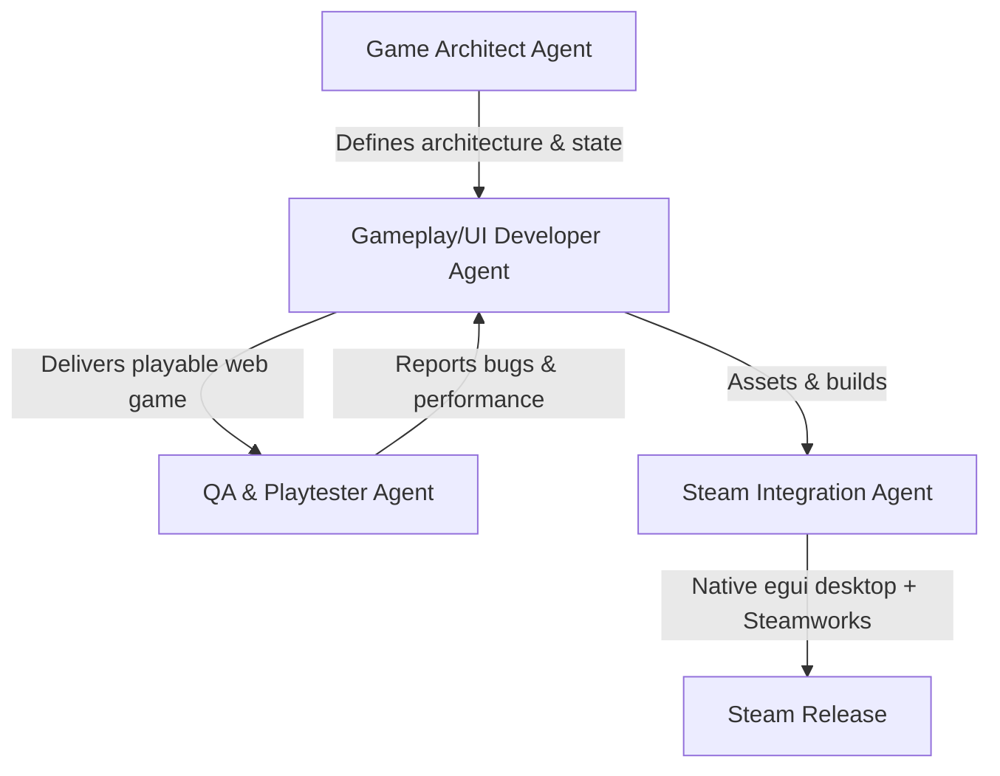

# AI Development Team: Web-to-Steam Game

This document outlines the specialized AI Agent roles, configurations, and workflows designed to build, polish, and package a web-based game suitable for eventual distribution on Steam.

---

## Agent Roles & Responsibilities



### 1. Game Architect Agent
*   **Role**: Tech Lead & Designer.
*   **Responsibilities**:
    *   Designs core game loops, state machines, entity architectures, and data structures.
    *   Standardizes save-game JSON formats and settings schema.
    *   Defines technical requirements for game engines (e.g., HTML5 Canvas API, Pixi.js, or Phaser).
*   **Default Prompt Focus**:
    *   *System instructions focus on performance optimization, clean state decoupling, and forward-compatibility with native Rust/Swift clients.*

### 2. Gameplay & UI Developer Agent
*   **Role**: Creative Implementer & Frontend Engineer.
*   **Responsibilities**:
    *   Writes modular, clean Javascript/Typescript and semantic CSS.
    *   Builds HUD overlays, start menus, settings, and inventory UIs (incorporating rich aesthetics like glassmorphism and smooth transitions).
    *   Implements keyboard, mouse, and controller input handling (mapping web inputs to standard gamepad APIs).
*   **Default Prompt Focus**:
    *   *System instructions focus on writing high-performance web code, proper requestAnimationFrame-based loops, clean canvas rendering, and responsive UI scaling.*

### 3. Steam Integration & Packaging Agent
*   **Role**: Build & Platform Engineer.
*   **Responsibilities**:
    *   Maintains the native desktop client (`desktop/` egui + `culinary-core` Rust).
    *   Integrates Steamworks via the Rust `steamworks` crate (achievements, cloud saves, overlay).
    *   Maintains multi-platform release builds (macOS, Windows, Linux) and native save paths.
*   **Default Prompt Focus**:
    *   *System instructions focus on desktop packaging, platform-native filesystem storage paths for game saves, offline support, and proper handling of Steam client callbacks.*

### 4. QA & Automated Testing Agent
*   **Role**: Playtester & Performance Analyst.
*   **Responsibilities**:
    *   Writes automated playtest scripts simulating high-frequency user actions.
    *   Monitors canvas rendering performance, frame-rate drops, and memory leaks.
    *   Audits controls for accessibility and ensures full keyboard-only navigation.
*   **Default Prompt Focus**:
    *   *System instructions focus on stress testing, boundary condition checks, and identifying visual/logic regressions.*

### 5. Culinary Content Creator Agent
*   **Role**: Content Creator & Writer.
*   **Responsibilities**:
    *   Researches real-world cooking science and culinary facts.
    *   Writes informative descriptions and tooltip science tips for items and recipes.
*   **Default Prompt Focus**:
    *   *System instructions focus on writing informative, engaging, and scientifically accurate text.*

### 6. Art & Audio Asset Agent
*   **Role**: Creative Asset Designer.
*   **Responsibilities**:
    *   Designs consistent game visual themes and layouts.
    *   Generates or selects food and tool icons.
    *   Configures sound trigger tables mapping sound effects to gameplay events.
*   **Default Prompt Focus**:
    *   *System instructions focus on visual coherence and satisfying sensory/audio feedback loops.*

### 7. Localization & Translation Agent
*   **Role**: Language Resource Translator.
*   **Responsibilities**:
    *   Manages translation source files (e.g. key-value assets).
    *   Translates game names, descriptions, and educational science tips into Steam languages.
*   **Default Prompt Focus**:
    *   *System instructions focus on semantic translation accuracy and managing international language encodings.*

### 8. Food Researcher Agent
*   **Role**: Culinary Expert & Recipe Designer.
*   **Responsibilities**:
    *   Researches raw ingredients and real-world dishes to map out their logical recipe progression.
    *   Breaks down intermediate cooking steps, intermediate food items, and the specific kitchen techniques required to create a dish.
*   **Default Prompt Focus**:
    *   *System instructions focus on culinary authenticity, structured progression mapping, and designing logical ingredient combining pathways.*

---

## Workspace Setup

### 1. Environment Variables
Create a `.env` file in the root of the project (copying from `.env.example`):
```bash
cp .env.example .env
```
Ensure your `GEMINI_API_KEY` is set inside the `.env` file.

### 2. Directory Structure
```
cooking/
├── content/              # Platform-neutral authoring (ingredients, recipes, achievements)
├── .env                  # Local API Keys (do not commit)
├── .env.example          # Template for environment variables
├── requirements.txt      # Python dependencies for Google Antigravity SDK
├── agents.md             # This agent team documentation
├── agents_config.py      # Declarative agent configuration setup
├── run_agent.py          # Interactive script to launch and run agents
├── skills/               # Domain-specific knowledge bases
│   ├── game_design/
│   │   └── SKILL.md      # Game mechanics, state flow architecture guidance
│   └── steam_porting/
│       └── SKILL.md      # Native desktop packaging & Steamworks guidance
├── web/                  # Vite web game (@culinary-alchemy/web) — dev client
├── core/                 # Rust culinary-core — GameRuntime, engines, tests
├── desktop/              # Native egui Steam desktop client
├── ios/                  # Native SwiftUI iOS client
├── android/              # Native Compose Android client
└── docs/                 # ARCHITECTURE, DATA_LAYER, DATA_SCHEMA, ROADMAP, …
```

### 3. Running the Agents
To invoke and chat with an agent (e.g., the Game Architect):
```bash
# Set up a virtual environment (optional but recommended)
python3 -m venv venv
source venv/bin/activate
pip install -r requirements.txt

# Run an agent interactively
python3 run_agent.py --agent architect
```

---

## Agent Orchestration Workflow

When starting a new feature or debugging an issue, follow this multi-agent loop:

1.  **Draft Design**: Ask the **Game Architect** to draft the specification or state machine for the feature.
2.  **Implementation**: Pass the specification to the **Gameplay & UI Developer** to generate the HTML, CSS, or JS changes. Content changes go in `content/`; run `npm run export-native` before native testing.
3.  **Local Testing**: Have the **QA Agent** review the code, suggest test cases, or inspect it for bottlenecks (like redundant redraw calls). Run `npm test` and `cargo test -p culinary-core`.
4.  **Packaging/Porting**: For build validation, use the **Steam Integration Agent** to run `npm run steam:dev` and verify native desktop builds.

---

## Token Optimization & Project Scoping Rules

To minimize token costs and maintain optimal context efficiency:
- **Default Modification Target**: All code edits and enhancements target the `web/` client subdirectory and data structures/recipes in the `core/` repository by default.
- **Search Scoping**: Do NOT search, grep, or read source files in native platforms (`desktop/`, `ios/`, `android/`, `core/` Rust code) unless explicitly requested by the user.
- **Context Preservation**: Avoid running workspace-wide searches (e.g. searching the root directory) unless targeting a specific file. Limit tool searches to the narrowest directory target possible.
- **Decoupled Validation**: Run tests locally in isolated modules (like `node src/engine/cli_test.js`) rather than processing full visual app rendering loops to keep validation steps quick and lightweight.
- **Git-Persisted Planning**: Always create or update `plans/active_plan.md` before starting code changes or execution commands. Upon completion of a task, archive the plan as `plans/archive/YYYY-MM-DD-feature-name.md` and document it in the index of `plans/README.md`.
