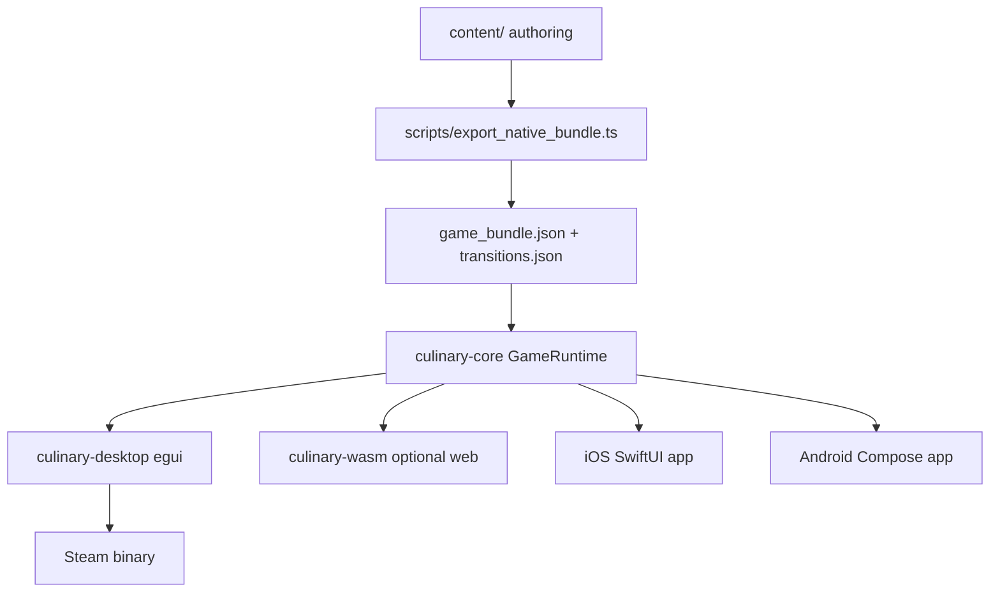
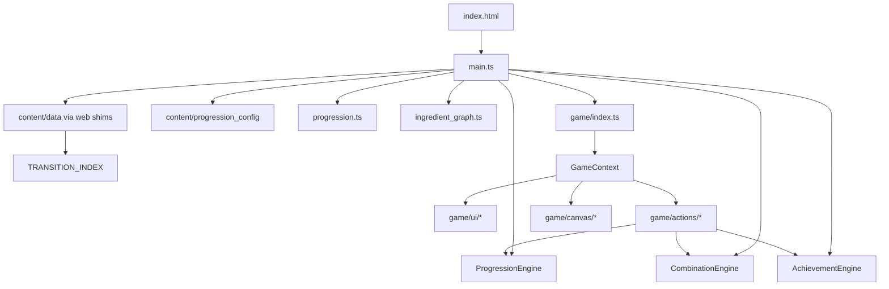

# Culinary Alchemy — Architecture

This document describes how the game is structured: the **web** client for rapid development, **native** shipping clients for Steam and iOS, shared data, and engine boundaries.

Platform code lives in **git submodules** — see [MONOREPO.md](./MONOREPO.md).

---

## Native clients (shipping)

Steam and iOS ship as **true native apps** — no embedded webview.



See **[DATA_LAYER.md](./DATA_LAYER.md)** for the shared bundle format, save schema, and per-platform APIs.

| Target | Stack | Entry |
|--------|-------|-------|
| **Web (dev)** | TypeScript + Vite + DOM (`web/src/core/`) | `npm run dev` |
| **Steam** | Rust `culinary-core::GameRuntime` + egui/winit | `npm run steam:dev` |
| **iOS** | SwiftUI + `GameEngine.swift` (FFI planned) | Xcode → `ios/CulinaryAlchemy.xcodeproj` |
| **Android** | Jetpack Compose + `GameEngine.kt` | Android Studio → `android/` |

- **`core/`** — Shared Rust `GameRuntime` (combine/technique, XP, saves), JSON loading, C FFI for mobile.
- **`desktop/`** — Native egui kitchen UI for macOS/Windows/Linux (Steam path); wraps `GameRuntime`.
- **`ios/`** — Native SwiftUI kitchen; loads exported JSON from `Resources/game/`.
- **`android/`** — Native Compose kitchen; loads exported JSON from `assets/game/`.

Export assets before native builds:

```bash
npm run export-native
```

---

## Web client (development)

The web game is **vanilla TypeScript + DOM** bundled with **Vite**. There is no canvas game loop; interaction is event-driven (pointer drag, toolbar clicks, dialogs). Pure game logic lives in **engines** that are decoupled from the UI. Content is **data-driven** — recipes are declared as JSON-like objects and flattened at load time into lookup indexes.



---

## Boot sequence

1. **`web/src/main.ts`** — Vite entry. Calls `bootstrapSharedData()` to load `/game/*.json` (or fall back to compiled `content/` modules), then lazy-loads `game.ts`.
2. **`content/data/`** — Platform-neutral authoring (starters, recipes, achievements). Web shims at `web/src/data/` re-export for legacy paths.
3. **`content/progression_config.ts`** — Technique trees and player toolbar actions.
4. **`web/src/engine/progression_engine.ts`** / **`combination_engine.ts`** — Register engine classes on `globalThis` (legacy bridge; engines are also imported directly).
5. **`web/src/progression.ts`** — `bootstrapProgression()` creates the browser `Progression` adapter (localStorage-backed).
6. **`web/src/game/index.ts`** — Creates `GameContext`, wires action callbacks, calls `initGame()`.

**Dev server:** `npm run dev` → `https://localhost:5173` (Vite root is `web/src/`).

**Production:** `npm run build` → `web/dist/`.

---

## Layer model

| Layer | Location | Responsibility |
|-------|----------|------------------|
| **Types** | `content/types.ts` + `web/src/types/` | Shared domain interfaces; web-only UI/runtime types |
| **Content** | `content/data/` | Authoring: ingredients, recipes, achievements, transition index |
| **Engines** | `web/src/engine/` + `content/achievement_engine.ts` | Pure logic: progression, recipe matching, achievement rules |
| **Game** | `web/src/game/` | UI, input, persistence, feedback — uses engines via `DataLayer` |
| **Graph** | `web/src/ingredient_graph.ts` | Progress map visualization (IIFE on `window.IngredientGraph`) |

### Separation of concerns

- **Model (serializable):** `ProgressionState`, discovery + achievement saves in localStorage, portable export JSON.
- **Runtime state (not saved as-is):** `GameState` in `game/state.ts` — includes DOM element references, drag state, filters.
- **View:** HTML in `index.html`, styles in `index.css` + `styles/`, rendered by game modules.

Engines never touch the DOM. The game layer never scans all recipes at runtime — it uses `TRANSITION_INDEX` and `CombinationEngine`.

---

## Game context pattern

`game/context.ts` exposes a singleton **GameContext**:

```ts
interface GameContext {
  state: GameState;      // mutable runtime state
  dom: GameDom;          // cached element references
  data: DataLayer;       // bridges globals → typed API
  actions: GameActions;  // late-bound to avoid circular imports
}
```

`game/index.ts` assigns `ctx.actions` after creation:

- `applyActionToCanvas`
- `combineElements`
- `applyToolToElement`

This breaks the workspace ↔ cooking import cycle (workspace calls actions through `getCtx().actions`).

### Gameplay event bus (`game/events/`)

Domain actions in `cooking.ts` emit typed events (`discovery`, `xp`, `achievementCheck`, `discoveryChanged`). `registerGameplayEffects()` wires subscribers for persistence, milestones, achievements, UI refresh, and journal updates — keeping gameplay orchestration out of the action module.

### Save repository (`game/save-repository.ts`)

`hydrateGameSession()` + `refreshGameSessionUi()` centralize portable save import and UI resync. `buildPortableSave()` is the single builder for export JSON.

### Security (`game/security/`)

- **`escapeHtml()`** — all dynamic `innerHTML` paths escape game text (ingredient names, blurbs, notifications, graph labels).
- **Save import** — max file size (2 MB), bounded arrays, strict id pattern (`snake_case`), rejects `__proto__` / prototype keys in XP maps.
- **localStorage load** — discovery and progression payloads sanitized on read (same id bounds).

---

## Core subsystems

### 1. Combination matching (`CombinationEngine`)

- **Technique match:** `(inputId, activeSkillId, progressionEngine)` → `MatchRecipeResult`
- **Combine match:** `(inputIds[])` → sorted key lookup in `byCombine`
- Respects `onePerAction` separation chains via `discoveredIds` option
- Returns locked-skill hints when a transition exists but prerequisites are unmet

### 2. Progression (`ProgressionEngine` + `Progression` adapter)

- Per-skill XP tracks with `unlockCriteria.prerequisites`
- Skill trees per category (`smash`, `peel`, `thermal`, `structure`, `tear`)
- Player **modes** (`separate`, `combine`) have their own XP tracks
- Unlock cache invalidated on `addXP` for performance

**Persistence keys:**

| Key | Content |
|-----|---------|
| `culinary_progression` | `{ xp, milestonesReached }` |
| `culinary_discovered` | `{ discovered[], recent[], highlights[], discoveryLog[] }` |
| `culinary_achievements` | `{ unlocked[], flags[] }` |
| `culinary_sound_enabled` | `"true"` / `"false"` |
| `culinary_reduced_motion` | `"true"` / `"false"` (optional; falls back to system preference) |
| `culinary_seen_help` | First-visit help flag |

Portable save export/import (`settings` panel) bundles discovery, progression, achievements, and settings into versioned JSON. See [DATA_SCHEMA.md](./DATA_SCHEMA.md).

### 3. Transition index (`buildTransitionIndex`)

Built once from `DISCOVERABLE_ITEMS` at load:

- `techniqueTransitions` — tool + input → outputs
- `combineTransitions` — sorted input set → result
- `byTechnique`, `byCombine` — O(1) lookups
- `affectableByTechnique` — pre-sorted input lists per tool
- `graphEdges` — cached edges for the progress map

### 4. Workspace (counter)

`game/canvas/workspace.ts` — drag/spawn/remove DOM elements on the counter. Coordinates with:

- `technique-target.ts` — valid-target highlights, merge target for combine
- `cabinet-drag.ts` — pantry → counter drag with rAF ghost
- `feedback/undo.ts` — single-step undo for spawn/remove/combine/technique

### 5. Action toolbar

`game/actions/toolbar.ts` — four top-level methods (Combine, Separate, Force, Transform) with sub-skill rows. `game/actions/mode.ts` holds shared mode helpers without canvas dependencies.

### 6. UI refresh batching

`game/ui/refresh.ts` — `refreshAfterGameplay({ skills, toolbar, cabinet, stats })` coalesces rebuilds after discoveries instead of triggering multiple full renders per action.

### 7. Achievements (`content/achievement_engine.ts` + `game/progression/achievements.ts`)

- Definitions and declarative rules authored in `content/data/`
- Evaluated after discoveries, XP gains, combines, and UI flags (`map_opened`, `undo_used`)
- Web: Trophies sidebar panel, localStorage + portable save export
- Rust: `AchievementEngine` in `culinary-core`; `GameRuntime::check_achievements()` on gameplay events

### 8. Feedback (`game/feedback/`)

- **Sounds** — Procedural Web Audio (`sounds.ts`): technique, UI, discovery, achievement cues
- **Hints** — Contextual failure guidance (`hints.ts`) for locked skills and invalid actions
- **Undo** — Single-step counter history (`undo.ts`)

### 9. Ingredient catalog cache

`getPlayableIngredientCatalog()` in `game/ingredients.ts` caches enriched pantry items; invalidated on discovery/milestone changes.

### 10. Settings & save I/O

`game/ui/settings.ts` — Kitchen Settings dialog (sound, reduced motion, export/import/reset). `game/ui/save-controls.ts` wires save buttons and file input. `game/settings.ts` persists reduced-motion preference (`data-motion` on `<html>`). Header keeps quick sound toggle (`S`); data actions live in settings only.

---

## Content authoring flow

```
content/data/recipes/<category>/*.ts
        ↓ merge in content/data/recipes/index.ts
DISCOVERABLE_ITEMS (+ properties from properties.ts)
        ↓ buildTransitionIndex()
TRANSITION_INDEX
        ↓ npm run export-native
game_bundle.json + transitions.json
        ↓
Web / Rust / iOS / Android consumers
```

Web tooling imports via thin shims at `web/src/data/` → `content/data/`.

Recipe builders:

- `_separationRecipe.ts` — primal → raw chains (`onePerAction: true`)
- `_techniqueRecipe.ts` — tool + input → output
- `_finalizedRecipe.ts` — `type: "recipe"` finished dishes

---

## Testing & validation

| Script | Purpose |
|--------|---------|
| `web/src/engine/cli_test.ts` | Engine regression: XP, unlocks, separation, combine, vertical-slice recipes |
| `web/src/engine/validate_content.ts` | Collision checks, starter action coverage, finalized recipe presence |
| `web/src/engine/validate_recipe_dependencies.ts` | Reference integrity, craft paths, orphans, duplicate ids |
| `web/src/engine/validate_recipe_dependencies.test.ts` | Unit tests for dependency validator |
| `web/src/engine/validate_ingredient_properties.ts` | All ingredients have properties; property map matches registry |
| `web/src/game/save-import.test.ts` | Portable save JSON parsing |
| `web/src/data/packs/validate_packs.ts` | Cultural pack validation (`npm run test:packs`) |

Run: `npm test` (web). `validate_content.ts` only runs its CLI output when executed directly (not when imported by pack validation).

---

## Global bridge (legacy)

Boot still exposes several values on `globalThis` for the graph module and gradual migration:

- `STARTER_ELEMENTS`, `DISCOVERABLE_ITEMS`, `TRANSITION_INDEX`
- `ACHIEVEMENTS`, `ACHIEVEMENT_RULES`
- `PROGRESSION_TIERS`, `PLAYER_ACTIONS`, `Progression`
- `ProgressionEngine`, `CombinationEngine`

New code should prefer **`@culinary-alchemy/content`** imports and `getCtx().data`.

---

## Directory reference

```
content/                    # Platform-neutral authoring (source of truth)
├── data/
│   ├── ingredients/        # starters, unlockables, properties.ts
│   ├── recipes/            # discoverable content by category
│   ├── packs/              # optional cultural DLC packs
│   ├── achievements.ts
│   └── transitions/        # index builder + exported transitions.json
├── progression_config.ts
├── achievement_engine.ts
└── types.ts

web/src/
├── main.ts                 # Entry
├── types/                  # Web UI/runtime types (re-exports content/types)
├── data/                   # Thin re-export shims → content/data/
├── engine/
│   ├── progression_engine.ts
│   ├── combination_engine.ts
│   ├── cli_test.ts
│   ├── validate_content.ts
│   ├── validate_recipe_dependencies.ts
│   └── validate_ingredient_properties.ts
├── progression_config.ts   # shim → content/
├── progression.ts
├── ingredient_graph.ts
└── game/
    ├── index.ts            # Game boot
    ├── context.ts / state.ts / data.ts / dom.ts
    ├── settings.ts         # client preferences (sound/motion keys)
    ├── save-export.ts / save-import.ts / save-io.ts
    ├── reset-progress.ts
    ├── actions/            # cooking, toolbar, mode
    ├── canvas/             # workspace, cabinet-drag, technique-target
    ├── progression/        # skills UI, milestones, achievements, notifications
    ├── feedback/           # sounds, undo, hints, workspace effects
    └── ui/                 # events, discovery, dialogs, settings, save-controls, views
```

---

## Extension guidelines

1. **New ingredient/recipe** — Add under `content/data/recipes/`; run `npm run export-native` then `npm test`.
2. **New technique skill** — Add to `content/progression_config.ts`; ensure transitions exist in content data.
3. **New achievement** — Add definition + rule in `content/data/`; export bundle; both TS and Rust evaluators pick it up automatically.
4. **New toolbar method** — Extend `PLAYER_ACTIONS` in `content/progression_config.ts`, `METHOD_ORDER`, and toolbar render logic.
5. **New UI panel** — Add DOM refs in `dom.ts`, wire in `events.ts`, keep logic out of engines.
6. **Steam/desktop** — See `skills/steam_porting/SKILL.md`; native egui client in `desktop/` + Rust `steamworks` crate.

---

## Known technical debt

- `ingredient_graph.ts` is still an IIFE with `@ts-nocheck` and `window.*` reads
- `globalThis` boot bridge duplicates data already available via ES modules
- `strict: false` in `tsconfig.json` — tighten incrementally
- No automated browser/E2E tests yet (Playwright is a devDependency but unused in CI)
