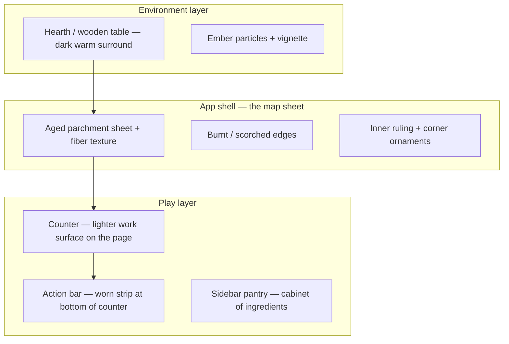

# Culinary Alchemy — Art Direction

A creative north-star for visuals, UI, motion, and asset production. This document translates [GAME_DESIGN.md](./GAME_DESIGN.md) pillars into concrete aesthetic decisions for artists, UI engineers, and content authors.

**Status:** Living document · reflects shipped web UI (emoji placeholders) and targets illustrated production art.

---

## 1. Creative north star

> **A worn recipe scroll unfurled beside a hearth — where every experiment leaves a mark.**

Culinary Alchemy is not a sterile cooking simulator or a neon crafting RPG. It is a **cozy discovery journal** dressed as a kitchen. Players should feel like they are learning at an old wooden table while firelight warms the margins of the page.

### One-sentence brief

Warm parchment, honest ingredients, gentle magic — education through tactile play.

### Design pillars (visual translation)

| Game pillar | Visual expression |
|-------------|-------------------|
| Discovery over checklist | Empty recipe slots, fogged map nodes, ink that “fills in” on unlock |
| Technique literacy | Icons and motion tied to real verbs (tear, char, fold) — never abstract runes |
| Honest progression | XP and skills look like marginalia on a master cook’s notes, not RPG loot |
| Educational flavor | Blurbs set in journal voice; illustrations show *process*, not just results |
| Tactile counter | Counter has weight, drag ghosting, crumbs, steam — the table is physical |

---

## 2. Tone & references

### Emotional register

- **Warm** — amber hearth glow, honeyed highlights, never cold clinical white
- **Curious** — sparkles on discovery, not combat fanfare
- **Gentle** — failures wobble and hint; no punitive red flashes
- **Literate** — serif headlines, handwritten accents, historical blurbs feel researched
- **Cozy, not childish** — whimsical without clipart; respect the intelligence of food-curious adults

### Reference touchstones (mood, not copies)

| Reference | Take |
|-----------|------|
| Cozy alchemy / crafting UIs | Experimentation loop, discovery celebration |
| Illustrated cookbooks (Ottolenghi, Salt Fat Acid Heat) | Ingredient beauty, process clarity |
| Studio Ghibli food stills | Steam, light, appetite appeal |
| Medieval manuscript marginalia | Scroll frame, copper accents, small ornaments |
| Modern cozy games (Unpacking, Venba) | Domestic warmth, readable UI at small scale |

### Avoid

- Hyper-realistic 3D kitchen sim
- Gothic/dark alchemy (skulls, purple smoke, occult symbology)
- Corporate recipe-app flat white minimalism
- Meme-heavy emoji-as-final-art (acceptable prototype only)
- Busy steampunk brass overload

---

## 3. Core visual metaphor



**Scroll** = meta-UI (header, pantry, skills, dialogs) — the player’s field journal.  
**Counter** = moment-to-moment play — a cutting board or bare patch of table on the page.  
**Hearth** = atmosphere behind the scroll — depth, not interactive chrome.

---

## 4. Color system

Canonical values live in `web/src/styles/tokens.css`. Do not introduce off-palette accents without updating tokens.

### Primary hues

| Role | Token / value | Usage |
|------|---------------|--------|
| Parchment base | `--scroll-parchment` · hsl(40, 48%, 90%) | Main sheet, cards |
| Ink | `--scroll-ink` · hsl(22, 30%, 26%) | Body text on parchment |
| Copper accent | `--scroll-copper` · hsl(26, 46%, 46%) | Rules, secondary emphasis |
| Ember / fire | `--scroll-ember` · hsl(28, 72%, 58%) | Hearth, success warmth |
| Honey highlight | `--scroll-honey` · hsl(38, 62%, 62%) | Discovery gold, XP fill |
| Moss / sage | `--scroll-moss` · hsl(128, 22%, 40%) | Primal ingredients, calm success |
| Table surround | `--table-deep` · hsl(24, 28%, 16%) | Outer environment |

### Ingredient state tints (cabinet badges & filters)

| State | Tint token | Meaning |
|-------|------------|---------|
| Primal | `--color-primitive-tint` | Broad categories |
| Raw | `--color-raw-tint` | Separated singles |
| Prepared | `--color-processed-tint` | Technique outputs |
| Recipe | `--color-recipe-tint` | Finished dishes |

### Semantic colors

| Meaning | Color | Notes |
|---------|-------|-------|
| Success / discovery | Gold + ember glow | Sparkles, modal border |
| Valid target | Warm gold ring | Technique highlight on counter |
| Failure | Cool gray puff | Never aggressive red screen |
| Danger / reset | `--color-danger` | Destructive actions only |

### Contrast rules

- Body text on parchment: **minimum 4.5:1** against `--scroll-parchment`
- Muted copy uses `--scroll-ink-muted`, not opacity hacks on black
- Interactive borders brighten toward `--color-border-hover` (fire hue), not blue focus rings

---

## 5. Typography

### Families

| Role | Font | Fallback | Use |
|------|------|----------|-----|
| Display / titles | **Cinzel** | Lora, serif | Logo, dialog titles, section headers |
| Body / UI | **Plus Jakarta Sans** | system-ui | Buttons, labels, stats, toolbar |
| Prose / blurbs | **Lora** | Georgia | Discovery descriptions, recipe book |
| Charm / marginalia | **Caveat** | cursive | Hints, flavor tooltips, “handwritten” notes |

*Note: Outfit is loaded but secondary; prefer Plus Jakarta Sans for new UI.*

### Scale & rhythm

- **Logo title:** Cinzel 600, ~1.35–1.5rem
- **Section headers:** Cinzel 500–600, 0.95–1.1rem, letter-spacing +0.02em
- **UI labels:** Plus Jakarta Sans 500–600, 0.72–0.82rem
- **Blurbs:** Lora 400 italic optional for pull quotes; 0.88–0.95rem, line-height 1.55
- **Charm hints:** Caveat 500–600, 0.95–1.1rem

### Typographic voice

- **Titles** feel inscribed — short, dignified (“New Discovery”, “Recipe Book”)
- **Blurbs** feel like a curious historian at the hearth — one surprising fact, not a textbook paragraph
- **Hints** feel like a mentor’s pencil note in the margin

---

## 6. Materials & texture

### Parchment

- Layered: fiber noise + mottle + warm edge stains + top/bottom vignette
- Never flat #F5F0E6 — always subtle grain at 5–15% opacity
- Fold creases at corners (`grand-scroll__crinkles--folds`) — suggest handling

### Page background — aged parchment scroll

> **Vibe:** an old map or medieval manuscript laid flat on the table — the whole page reads as a single aged, fire-touched sheet of parchment.

The full-page background (behind the scroll/counter chrome) is a static parchment field. It is intentionally background-only: it never alters layout, components, center content, or the existing ember/mote animations that drift above it.

| Layer | Role | Implementation |
|-------|------|----------------|
| Parchment field | Warm amber sepia base with uneven tonal mottling | `body` + `.fantasy-backdrop__warmth` radial gradients |
| Grain / noise | Fine paper fiber texture | `.fantasy-backdrop__warmth::before` — SVG `feTurbulence`, `mix-blend-mode: multiply`, ~32% opacity |
| Crinkle / folds | Subtle diagonal creases suggesting a handled sheet | `.fantasy-backdrop__warmth::after` — repeating-linear-gradient creases |
| Burned vignette | Darkened, singed edges and scorched corners | `.fantasy-backdrop__vignette` + `::before` corner scorch |

**Background palette (parchment scroll):**

| Swatch | Hex | Use |
|--------|-----|-----|
| Light parchment | `#F5E6C8` | Base sheet tone |
| Amber gold | `#D4A843` | Tonal mottling, warm stains |
| Dark sepia | `#8B6914` | Crease ink, deep mottle, edge grading |
| Scorch brown | `#261406` / `rgba(38,20,6,…)` | Burned vignette + corner scorch |

**Direction:** keep it quiet and aged — the parchment is a stage, not a focal point. Mottling is irregular (no symmetry), grain stays subtle, and burned edges frame the play area without crowding it. Any future change here must remain background-only.

### Wax seal & accents

- Wax seal on the map (`grand-scroll__seal`) — red wax, optional discovery milestone reward visual; fits the pirate-map vibe
- Corner ornaments + inner ruling (`grand-scroll__inner-frame`, `grand-scroll__ornament`) — light manuscript marginalia, not heavy framing

### The map sheet — old pirate / medieval paper (no hardware)

> **Vibe:** an old pirate's map or medieval manuscript page — a single piece of aged, fire-touched paper laid flat. **No wooden rollers, rods, knobs, or scroll hardware.** The paper itself is the star.

- `grand-scroll__parchment` is one sheet of aged map paper: warm sepia parchment texture (grain + stains + folds), slightly **irregular rounded corners** (`border-radius` with uneven values), and a lifted drop shadow.
- **Burnt / scorched edges**: darkened, uneven perimeter with scorched corners — layered via `grand-scroll__crinkles--edges` (behind content) and a `grand-scroll__parchment::after` perimeter frame (above content, `mix-blend-mode: multiply`) so the singed edge reads even where panels cover the paper.
- Keep edge darkening soft enough that UI inside the map stays legible — it should frame, never muddy, the content.
- The entrance still gently "unrolls" top→bottom (`scroll-unfurl-down` clip reveal) — motion only, no physical rollers.

**Avoid:** wooden dowels, brass knobs, cylindrical roller bars, or any mechanical scroll apparatus. The aesthetic is *paper*, not *device*.

### Glass / cards

- `--color-bg-glass` for floating panels — warm cream, not iOS frosted gray
- Borders: 1px `hsla(38, 36%, 58%, 0.45)` — tea-stained edge

### Counter workspace

- Lighter than parchment — a **work zone** (bleached board / flour dust)
- Inset shadow suggests recessed surface
- Dashed circular **workspace ring** — soft target area, not a game reticle

---

## 7. UI components

### Header

- Logo emoji (interim) → future: small copper skillet or mortar icon + wordmark
- Stats counter: quiet, journal-like (“Discovered: 12 / 66”)
- Primary CTA: Recipe Book (gold fill). Secondary: map, save. Danger: reset only.

### Pantry / cabinet

- Ingredients as **tiles** with state tint strip or corner badge
- Recent discoveries: warm outer glow (`cabinet-item--recent-new`), 2.6s decay
- Search field: inset, parchment-toned, no harsh box shadow

### Action toolbar

- “Worn strip” aesthetic — bottom of counter, physically attached
- Method buttons: icon + label; active method reads as **pressed into wood**
- Sub-skills: smaller chips; locked = desaturated + lock glyph, not hidden

### Dialogs

| Dialog | Visual priority |
|--------|-----------------|
| Discovery | Highest juice — gold border, sparkles, large hero asset |
| Trophies | Grid of wax-seal or medal tiles; locked = silhouette + hint on hover |
| Recipe book | Calm grid, hover reveals blurb |
| Discovery journal | Chronological list, marginalia timestamps |
| Settings | Quiet utility sheet — export/import, sound, motion, reset |
| Help | Illustrated steps optional; keep scannable |
| Progress map | Diagram clarity over decoration |

### Progress map

- Nodes: rounded rects, emoji/icon + name
- Locked nodes: `???` silhouette, desaturated parchment
- Edges: technique = solid warm line; combine = converging branches
- Toolbar: minimal — search, depth, “show undiscovered” toggle

---

## 8. Ingredients & illustration

### Current state (prototype)

- Unicode emoji per ingredient — fast to ship, inconsistent across platforms
- Acceptable for vertical slice; **not final art**

### Target state

| Asset type | Spec | Notes |
|------------|------|-------|
| Ingredient icon | 128×128 PNG @1x, SVG source | 3/4 view, soft shadow, readable at 48px |
| Prepared food | Slightly richer detail | Show transformation (mashed, charred edge) |
| Recipe hero | 256×256 or 16:9 card | Plated or bowl shot, steam optional |
| Primal category | Simpler cluster icon | Basket, branch, cluster — not one specific fruit |

### Illustration style guide

- **Line:** Soft ink outline or none — painterly edges preferred over hard comic ink
- **Light:** Top-left warm key, subtle hearth rim from bottom-right
- **Shadow:** Single contact shadow, brown not black
- **Palette:** Pull from ingredient’s natural colors; harmonize to warm global grade
- **Background:** Transparent for icons; parchment oval plate optional for recipes
- **Abstraction:** Readable silhouette at 32px — test small

### Emoji → art migration

1. Ship illustrated starters + vertical-slice chain first
2. Cultural packs ship with unified pack border color (see §10)
3. Keep `emoji` field as fallback key until asset pipeline supplies `iconUrl`

---

## 9. Motion & feedback

### Principles

- **Ease:** `cubic-bezier(0.33, 0, 0.2, 1)` for UI; elastic only for discovery
- **Duration:** UI 200–450ms; celebration 650–1100ms; ambient loops 7–8.5s
- **Reduced motion:** Shipped — `prefers-reduced-motion` and Settings toggle set `data-motion="reduced"` on `<html>`, disabling sparkles, ember flicker, and shake

### Key animations (shipped)

| Moment | Motion |
|--------|--------|
| Discovery modal | Scale + elastic in; gold glow swell |
| Sparkles | Radial burst from center, staggered delay |
| Hearth backdrop | Ember flicker, workspace pulse |
| Drag | Ghost follows cursor; valid merge target pulses |
| Success on counter | Warm gold flash |
| Fail | Cool puff + gentle shake |
| Undo | No drama — instant revert |

### Sound pairing (see audio direction)

- Discovery: bright chime + sparkle sync
- Technique success: contextual (chop, bubble, sizzle)
- Fail: soft thud, never punishing buzzer

---

## 10. Cultural packs (visual identity)

Each pack shares global scroll/hearth UI. Pack identity appears in **content**, not a full reskin.

| Pack | Accent suggestion | Illustration notes |
|------|-------------------|-------------------|
| Japanese | Indigo ink + natural wood | Clean negative space, ceramic bowls |
| Mexican | Terracotta + maize yellow | Comal, lime, earthenware |
| West African | Palm red + kente-inspired border *pattern only* | Respectful, avoid costume clichés |
| Indian | Turmeric gold + spice brown | Brass vessels, steam |
| French | Cream + wine burgundy | Copper pots, bakery browns |
| Chinese | Celadon + wok charcoal | Wok hei smoke, bamboo steamers |
| Italian | Tomato red + olive green | Rustic ceramic, flour dust |
| Greek | Aegean white + olive | Marble, lemon, phyllo layers |
| Mesoamerican | Cacao brown + maize | Clay comal, banana leaf |
| Scandinavian | Birch pale + lingon red | Rye texture, simple plating |

**Rule:** Cultural accents appear in pack splash art, recipe hero borders, and map node badges — not replacement of core parchment UI.

---

## 11. Iconography & technique verbs

Technique icons should read at 24px:

| Family | Visual language |
|--------|-----------------|
| Separate / peel / tear | Hands, knife, peel spiral |
| Force / smash | Mortar, pestle, press |
| Transform / thermal | Flame tiers: char → pan → oven |
| Combine / structure | Bowl, whisk, fold arrows |

Avoid: generic magic wand, lightning bolt, RPG sword.

---

## 12. Accessibility

| Requirement | Direction |
|-------------|-----------|
| Color | Never encode state by color alone — pair with icon, label, pattern |
| Text | Minimum 12px effective; blurbs max ~3 lines in discovery modal |
| Motion | `prefers-reduced-motion` or Settings → reduced motion disables sparkles, ember flicker, shake |
| Touch | 44×44px minimum targets on iOS; counter drag handles enlarged |
| Screen readers | Emoji have `aria-hidden`; names always in text |
| Color blindness | Primal/raw/prepared/recipe use **tint + label**, not hue alone |

---

## 13. Platform notes

| Platform | Art considerations |
|----------|-------------------|
| **Web** | SVG textures OK; optimize PNG sheets; target 60fps drag |
| **Steam / desktop** | Same assets; optional 125–150% UI scale; richer particles OK |
| **iOS** | Safe areas; notch padding; illustrated assets @2x/@3x; native SwiftUI (system emoji fallback) |

### Marketing / store key art

- Hero: scroll unfurled, ingredients orbiting counter, hearth bokeh
- No text in key art — logo overlaid per store guidelines
- Tagline for stores: *“A cozy hearth of discoveries”*

---

## 14. Asset pipeline & delivery

### Folder convention (proposed)

```
web/public/assets/
  ingredients/     # 128px icons by id
  recipes/         # hero art by id
  ui/              # logo, ornaments, empty states
  packs/           # per-cultural-pack banners
  audio/           # (existing feedback sounds)
```

### Naming

`{id}.png` matches content `id` in `DATA_SCHEMA.md` (e.g. `mashed_potato.png`).

### Export checklist per asset

- [ ] Transparent PNG + master SVG/PSD
- [ ] Readable at 48px (ingredient) / 128px (recipe)
- [ ] Color profile sRGB
- [ ] Named layer groups for localization-safe text separation

---

## 15. Production phases

Aligned with [ROADMAP.md](./ROADMAP.md):

| Phase | Art deliverables |
|-------|------------------|
| **Now** | Document + tokens locked; emoji prototype |
| **Phase 1** | Logo mark, discovery modal polish, empty states |
| **Phase 2** | Illustrated vertical-slice chain; recipe book heroes |
| **Phase 2+** | Cultural pack banners + 4 icons per pack minimum |
| **Phase 4** | Reduced-motion pass; high-contrast theme optional |
| **Phase 7** | Full emoji replacement; screenshot share cards |

---

## 16. Quick decision checklist

When evaluating new art or UI:

1. Does it feel **warm and handwritten**, not clinical?
2. Is the ingredient **recognizable at small size**?
3. Does motion **celebrate curiosity**, not combat?
4. Would a food-curious adult find the tone **respectful**?
5. Does it sit on **parchment + hearth**, not generic gray UI?
6. Could this appear in a **real cookbook margin**?

If any answer is no, revise.

---

## Related documents

| Doc | Link |
|-----|------|
| Game design intent | [GAME_DESIGN.md](./GAME_DESIGN.md) |
| Content structure | [DATA_SCHEMA.md](./DATA_SCHEMA.md) |
| Engineering layout | [ARCHITECTURE.md](./ARCHITECTURE.md) |
| Ship timeline | [ROADMAP.md](./ROADMAP.md) |
| Live tokens | `web/src/styles/tokens.css` |
