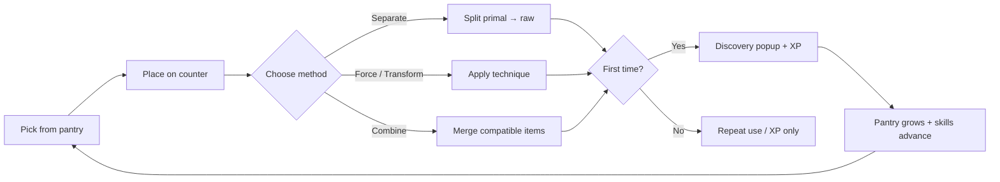

# Culinary Alchemy — Game Design

Design intent, core loop, player-facing systems, and content philosophy for the cooking discovery game.

---

## Elevator pitch

**Culinary Alchemy** is an educational ingredient-discovery game inspired by crafting alchemy titles. Players drag primal pantry items onto a kitchen counter, apply real cooking techniques (separate, smash, heat, combine), and unlock new ingredients and finished dishes. Each discovery teaches a short culinary fact. The fantasy is a **scroll unfurled at a hearth** — learning to cook by experimentation, not recipes handed upfront.

---

## Design pillars

1. **Discovery over checklist** — Players uncover the graph; the recipe book fills in as they experiment.
2. **Technique literacy** — Actions map to real cooking verbs (separate, char, emulsify), not abstract "crafting."
3. **Honest progression** — XP comes from *doing* techniques; skills unlock from practice, not arbitrary gates.
4. **Educational flavor** — Blurbs and tips reward curiosity; tone is warm, historical, and accessible.
5. **Tactile counter** — The workspace is a physical-feeling surface: drag, merge, particles, sound, undo.

---

## Core loop

### Session flow

1. **Onboarding** — First visit opens help; default method is **Separate** (teaches primal → raw).
2. **Experiment** — Drag berries, separate to strawberry, combine with water, smash tubers, char fruit.
3. **Reward** — Discovery modal: emoji, description, action XP bar, historical blurb, chime.
4. **Expand** — New items appear in cabinet; skills panel shows unlock progress; map reveals connections.
5. **Aspire** — Finalized recipes (`type: "recipe"`) count toward unlocking **Transform** and fill the recipe book.

---

## Player actions (toolbar)

Four top-level methods. Selecting a method only changes mode; **sub-actions execute** the technique.

| Method | Player verb | What it does |
|--------|-------------|--------------|
| **Separate** | Split apart | Primal clusters → one raw ingredient per action (berries → strawberry, …) |
| **Combine** | Merge | Drag together or auto-merge compatible pairs on counter |
| **Force** | Crush / grind | Smash path: tubers → mash, grind, knead, emulsify |
| **Transform** | Heat / cook | Thermal path: char, roast, boil (unlocks after 5 recipe discoveries) |

Sub-skills appear in a second row when a method has multiple unlocked techniques. Empty methods (no transitions in content) are hidden.

---

## Ingredient taxonomy

| State | Player sees | Examples |
|-------|-------------|----------|
| **Primal** | Broad categories in pantry at start | Berries, Tubers, Water |
| **Raw** | Separated singles | Strawberry, Potato, Carrot |
| **Prepared** | Intermediate products | Mashed potato, Sprouted seeds, Charred apple |
| **Recipe** | Finished dish | Berry brew, Hearth mash, Tuber stew |

Cabinet filters: by **type** (Produce, Forage, …), by **state** (Primal / Raw / Prepared / Recipe / Recent).

---

## Progression systems

### Skill XP (practice-based)

- Performing a technique awards XP to its **track** (tool id or mode id).
- Example: smashing awards `smash` XP; combining awards `combine` XP; every first-time discovery also awards `separate` XP.
- When prerequisites are met (e.g. 3 smash XP → unlock Pound), a skill unlock toast appears.
- Max XP per track: **99** (configurable in `content/progression_config.ts`).

### Skill trees (five categories)

Each category is a linear or branching chain of real techniques:

- **Smash** — manual force → mortar → press → grind → knead → emulsify
- **Peel / Tear** — separation refinements (slice, shred, …)
- **Thermal** — char → dry heat → wet heat → …
- **Structure** — hand mix → fold → blend (combine-adjacent)

Higher skills add more `actions` ids that recipes can reference.

### Discovery counting

- Header shows **discovered / total** discoverable processed items (honest count, not starters).
- **Transform** unlock uses count of finalized `type: "recipe"` discoveries only.

### Milestones (future)

Schema supports ingredient **shipments** (unlock new primitives at recipe thresholds). Not yet populated in content (`content/data/ingredients/unlockables.ts`).

### Trophies (achievements)

18 trophies track discovery, technique mastery, and meta play. Rules are declarative (shared between web and native runtimes). Categories:

| Category | Examples |
|----------|----------|
| Discovery | First raw separation, first recipe, map complete |
| Technique | First combine, skill unlocks (Pound, Peel, Hand mix), XP milestones |
| Meta | Journal entries, opening the progress map, using undo |

Trophies appear in the **Trophies** sidebar tab (`A`). Unlock toasts celebrate new awards. Optional `steamId` on each definition maps to future Steam partner achievements.

---

## Workspace interactions

| Interaction | Behavior |
|-------------|----------|
| **Drag from pantry** | Spawns item on counter; undoable |
| **Drag on counter** | Reposition; threshold before "moved" |
| **Drag-to-combine** | In Combine mode, hover-merge highlights partner; release to merge |
| **Click item + sub-action** | Applies technique to selected counter items |
| **Undo** | One step: spawn, remove, combine, or technique (button + Cmd/Ctrl+Z) |
| **Clear** | Remove all counter items |

### Discovery rules

- **First-time discovery** — Inputs stay on counter (not consumed); outputs appear via discovery flow.
- **Repeat craft** — Inputs consumed; output spawned; combine/technique undo recorded.
- **Separation exhaust** — When all outputs in a chain are known, separate fails on that primal.

---

## UI surfaces

| Surface | Purpose |
|---------|---------|
| **Cabinet** | Draggable pantry with search and filters |
| **Skills** | XP bars, locked/unlocked technique cards |
| **Counter** | Main play area |
| **Action bar** | Method + sub-skill selection |
| **Discovery dialog** | Celebration + XP + blurb queue (multi-discovery sequential) |
| **Discovery journal** | Timestamped log of all non-primitive discoveries |
| **Trophies** | Achievement grid with locked/unlocked states and hints |
| **Recipe book** | Finalized dishes only, with tooltips |
| **Progress map** | Ingredient graph — nodes, technique/combine edges, focus depth |
| **Settings** | Sound, reduced motion, save export/import, reset progress |
| **Help** | First-visit onboarding copy |

### Keyboard shortcuts

Power-player bindings (`game/ui/keyboard-shortcuts.ts`):

| Keys | Action |
|------|--------|
| `1`–`4` | Select toolbar method (Combine, Separate, Force, Transform) |
| `[` / `]` | Cycle sub-skills within active method |
| `Enter` | Apply selected sub-skill to focused counter item |
| `U` / `⌘Z` | Undo last counter action |
| `C` | Clear counter |
| `/` | Focus pantry search |
| `P` / `K` / `J` / `A` | Toggle pantry / skills / journal / trophies panels |
| `B` | Recipe book |
| `M` | Progress map |
| `,` | Settings |
| `S` | Toggle sound |
| `?` | Help |
| `Esc` | Close topmost modal or panel |

---

## Feedback & juice

- **Sound** — Procedural Web Audio library (`game/feedback/sounds.ts`): discovery chime, technique verbs, UI clicks, achievement fanfare; toggle in header (`S`) or settings
- **Hints** — Gentle floating guidance on failed combine/technique attempts (`game/feedback/hints.ts`)
- **Particles** — Success steam, fail puff, merge sparkles
- **Workspace flash** — Warm gold on success, cool on fail; shake on invalid combine
- **Pantry highlight** — Recent discoveries glow temporarily
- **Discovery animation** — Sparkles, replay CSS on modal content

---

## Content philosophy

### Separation chains

Primal items represent **foraging categories**, not shortcuts. One berry per separate action reinforces sorting and pacing. Each raw item carries a unique **blurb** (history, science, folklore).

### Ingredient properties

Optional `properties` on each item (`content/data/ingredients/properties.ts`) describe physical traits (peelable, toxic raw, fermentable, etc.). Attached at load for all base-game ingredients; used by validators today and intended for future technique matching.

### Techniques

Each technique file should answer: *What real kitchen action is this?* Outputs should be plausible intermediates toward a dish.

### Finalized recipes

`type: "recipe"` items are **serveable goals** — they appear in the recipe book and drive the Transform unlock. Aim for multi-step chains (raw → prepared → prepared → recipe).

### Tips vs blurbs

- **tip** — Actionable cooking hint for the player
- **blurb** — Narrative / educational flavor for discovery modal and recipe cards
- **description** — Neutral item or transition description

---

## Balance knobs (design-facing)

| Knob | Location | Effect |
|------|----------|--------|
| XP per action | Recipe `xpAwarded`, cooking defaults | Pace of skill unlocks |
| Prerequisite thresholds | `unlockCriteria.prerequisites` | Skill tree pacing |
| Transform unlock | `playerActions.change.unlockCriteria` | When heat methods appear |
| `onePerAction` | Separation recipes | Discovery pacing per primal |
| `maxSkillExp` | `content/progression_config.ts` | Skill grind ceiling |
| Discoverable total | `content/data/` | Session length / completionism |
| Achievement rules | `content/data/achievement_rules.ts` | Trophy unlock pacing |

---

## Target audience & tone

- **Audience** — Casual players who enjoy alchemy/crafting loops; food-curious learners; cozy game fans.
- **Tone** — Warm hearth fantasy, not gritty simulation. Errors are gentle ("wobble", floating hint). Copy is concise and readable (Outfit / Lora / Cinzel typography).

---

## Non-goals (current version)

- Real-time cooking simulation (timers, burn states)
- Multiplayer or trading
- Inventory limits or spoilage
- Nutrition or calorie modeling
- Full kitchen equipment simulation

These may appear in future phases (see [ROADMAP.md](./ROADMAP.md)).

---

## Success metrics (design)

- Player reaches first **raw** separation within 60 seconds
- Player discovers first **combine** result without external guide
- Player unlocks **Transform** within a typical session (5 recipe discoveries)
- Recipe book has clear empty-state directing experimentation
- Progress map makes the "what's next?" graph legible at depth 2

---

## Related documents

- [README.md](../README.md) — quick start
- [ARCHITECTURE.md](./ARCHITECTURE.md) — technical structure
- [DATA_LAYER.md](./DATA_LAYER.md) — cross-platform bundle and save contract
- [DATA_SCHEMA.md](./DATA_SCHEMA.md) — content and save formats
- [generated/CONTENT_REFERENCE.md](./generated/CONTENT_REFERENCE.md) — shipped ingredients, techniques, transitions
- [ROADMAP.md](./ROADMAP.md) — planned features and phases
- [ART_DIRECTION.md](./ART_DIRECTION.md) — visual identity and asset guidelines
- [content/README.md](../content/README.md) — authoring workflow
