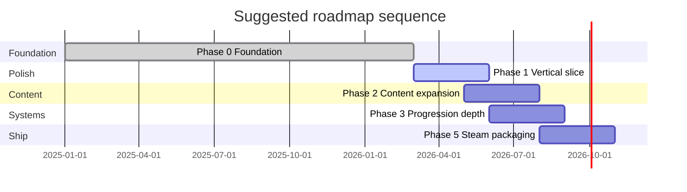

# Culinary Alchemy — Roadmap

Planned work organized by phase. Status reflects the codebase as of the TypeScript migration and performance cleanup.

**Legend:** ✅ Done · 🟡 Partial · ⬜ Planned

---

## Current state snapshot

| Area | Status |
|------|--------|
| TypeScript codebase | ✅ |
| Core loop (separate, combine, smash, char) | ✅ |
| Vertical slice content (66 items, 5 recipes) | ✅ |
| Skill XP + unlock trees | ✅ |
| Discovery UI + sound + undo | ✅ |
| Progress map (ingredient graph) | ✅ |
| Engine + content validation tests | ✅ |
| Recipe dependency validator | ✅ |
| Ingredient properties (77 items) | ✅ |
| Settings panel + save export/import | ✅ |
| Keyboard shortcuts | ✅ |
| Achievements (web) | ✅ |
| Steam / desktop packaging | 🟡 |
| Milestone ingredient shipments | ⬜ |
| Full technique trees populated in content | 🟡 |

---

## Phase 0 — Foundation ✅

*Goal: Playable web prototype with clean architecture.*

- [x] Modular game package (`game/` context, actions, canvas, ui)
- [x] Pure engines (progression + combination)
- [x] Transition index from recipe data
- [x] localStorage saves (discovery + XP)
- [x] Vite dev/build pipeline
- [x] TypeScript migration (`src/**/*.ts`)
- [x] `npm test` — cli_test, validate_content, validate_recipe_dependencies, validate_ingredient_properties, save-import
- [x] `npm run test:packs` — cultural pack validation (optional content)
- [x] UI refresh batching, catalog cache, debounced search

---

## Phase 1 — Vertical slice polish 🟡

*Goal: One complete path from primal → dish feels great.*

- [x] Starter combines + smash + thermal recipes
- [x] Five finalized recipes (berry brew, hearth mash, …)
- [x] Drag-to-combine on counter
- [x] Technique valid-target highlights
- [x] Discovery XP display on popup
- [x] First-visit help + default Separate
- [x] Honest discovered/total stats
- [x] Keyboard shortcuts (methods, pantry, settings, sound, help)
- [x] Save export / import (Settings panel)
- [ ] Playwright smoke test in CI (drag, separate, dismiss discovery)
- [ ] Keyboard-only path audit (focus management)
- [ ] Tighten `strict` TypeScript mode

---

## Phase 2 — Content expansion 🟡

*Goal: Enough discoveries for 2–4 hours of first-time play.*

### Ingredients & chains

- [x] All primal separation chains (berries, fruits, water, roots, tubers, nuts, mushrooms, grasses, shoots, seeds, shellfish)
- [ ] Second-tier prepared ingredients per category
- [ ] Populate `unlockables.ts` + milestone shipments in `progression_config.ts`
- [ ] 15–20 additional finalized recipes across categories

### Techniques in data

- [ ] Recipes using peel, tear, pound, press (not just smash/char)
- [ ] Structure path combines (hand_mix, fold)
- [ ] Multi-output techniques where pedagogically useful

### Tooling

- [x] Auto-generated content reference (`docs/generated/` — ingredients, techniques, transitions)
- [ ] Content authoring guide (recipe file templates)
- [ ] Dev-only graph/transition inspector
- [x] Recipe dependency validator (orphan items, unreachable recipes, reference integrity)
- [x] Ingredient properties registry + completeness validator

**Milestone suggestion:**

| Recipes discovered | Shipment unlock |
|--------------------|-----------------|
| 3 | Example: honey, eggs |
| 8 | Example: grains, dairy |
| 15 | Example: spices |

---

## Phase 3 — Progression depth ⬜

*Goal: Skill trees feel meaningful end-to-end.*

- [ ] Wire all technique `actions` ids to real recipe transitions
- [ ] Locked-skill hints on all failed technique attempts
- [ ] Skill panel: show next unlock threshold prominently
- [ ] Optional: per-category mastery badges
- [ ] Optional: daily challenge recipe (fixed seed)

### Balance pass

- [ ] XP curve review (unlock timing for Pound, Hand mix, Roast)
- [ ] Transform unlock threshold (5 recipes — validate with playtest)
- [ ] Separation `onePerAction` pacing across all primals

---

## Phase 4 — UX & accessibility 🟡

*Goal: Comfortable for keyboard, screen readers, and long sessions.*

- [ ] Focus management across toolbar ↔ counter ↔ modals
- [ ] ARIA live region for discoveries and unlocks
- [x] Reduce motion preference (`culinary_reduced_motion` + `data-motion` on `<html>`)
- [ ] Controller / gamepad support for toolbar + focus navigation
- [x] Settings panel (sound, reduced motion, export/import/reset save)
- [x] Confirm destructive actions (reset progress confirms; clear counter confirms via undo)

---

## Phase 5 — Platform & Steam ⬜

*Goal: Shippable **native** desktop build with Steamworks (no webview).*

- [x] Rust `culinary-core` shared engines + export pipeline
- [x] Native egui desktop client (`desktop/`, `npm run steam:dev`)
- [ ] File-based save paths
- [ ] `steamworks` Rust crate integration (AppID, overlay, init)
- [ ] Achievements mapped to discoveries and skill unlocks
- [ ] Steam Cloud sync for save JSON
- [ ] Offline-first validation
- [ ] macOS / Windows / Linux build CI

Legacy `steam/` Tauri webview shell has been removed; use `desktop/`.

**Suggested achievements:**

| ID | Trigger |
|----|---------|
| `FIRST_SEPARATION` | First raw ingredient |
| `FIRST_RECIPE` | First finalized dish |
| `SKILL_POUND` | Unlock Pound |
| `MAP_COMPLETE` | Discover all items |

---

## Phase 6 — Architecture cleanup ⬜

*Goal: Maintainable codebase for long content growth.*

- [ ] Convert `ingredient_graph.ts` to ES module (`export renderIngredientGraph`)
- [ ] Remove `globalThis` boot bridge; direct imports everywhere
- [ ] Split `ingredients.ts` into catalog / filters modules if it grows
- [x] Versioned save format (`{ version: 1, … }`) with import validation
- [ ] Optional: JSON content packs loaded at runtime for modding

---

## Phase 7 — Future ideas (backlog)

*Not committed — evaluate after Phase 2 playtest.*

- Timed techniques (simmer, rest) with gentle clock UI
- Full save export already includes discovery journal timestamps; dedicated journal-only export TBD
- Photo / illustration assets per recipe (replace emoji)
- Localization (i18n keys in content)
- Mobile touch optimizations beyond current scaffolds
- Sandbox / creative mode (infinite pantry)
- Share discovery screenshot card
- Cultural content packs (`content/data/packs/`)

---

## Recommended execution order

**Immediate next steps (highest ROI):**

1. Playwright smoke test for separate → discovery → dismiss
2. Populate 2–3 milestone unlocks + matching unlockables in `content/`
3. Add peel/tear recipes for at least one primal chain
4. Native desktop smoke test: `npm run steam:dev`
5. Use ingredient `properties` in technique matching (e.g. toxic raw, peelable outer layer)

---

## How to use this roadmap

- **Content designers** — Edit `content/`; use [DATA_SCHEMA.md](./DATA_SCHEMA.md); run `npm test` before merging.
- **Gameplay engineers** — Phase 1 + 3; reference [ARCHITECTURE.md](./ARCHITECTURE.md) and [DATA_LAYER.md](./DATA_LAYER.md).
- **Platform engineers** — Phase 5; coordinate save format with [DATA_SCHEMA.md](./DATA_SCHEMA.md).
- **AI agents** — See [agents.md](../agents.md); update this file when phases complete.

---

## Document index

| Doc | Audience |
|-----|----------|
| [README.md](../README.md) | Everyone — quick start |
| [ARCHITECTURE.md](./ARCHITECTURE.md) | Engineers |
| [DATA_LAYER.md](./DATA_LAYER.md) | Engineers — cross-platform contract |
| [DATA_SCHEMA.md](./DATA_SCHEMA.md) | Content + engineers |
| [GAME_DESIGN.md](./GAME_DESIGN.md) | Design + product |
| [MONOREPO.md](./MONOREPO.md) | Everyone — git submodules |
| [ART_DIRECTION.md](./ART_DIRECTION.md) | Art, UI, marketing |
| [RECIPES_REFERENCE.md](./RECIPES_REFERENCE.md) | Content inspiration |
| [generated/CONTENT_REFERENCE.md](./generated/CONTENT_REFERENCE.md) | Shipped ingredients, techniques, transitions |
| [content/README.md](../content/README.md) | Content authoring |
